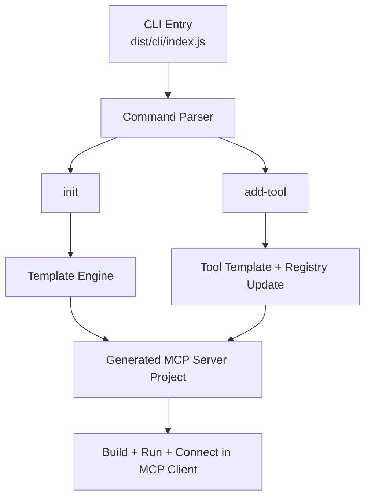
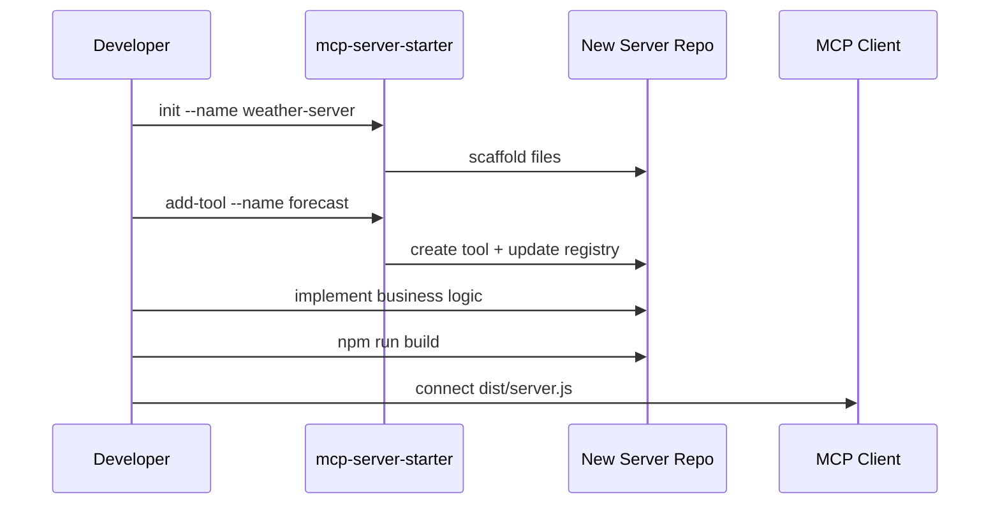

# mcp-server-starter

Scaffold a ready-to-run Model Context Protocol (MCP) server with one command.

This package is a developer productivity tool for anyone building MCP servers. Instead of repeatedly wiring up server bootstrapping, tool registration, TypeScript config, and packaging by hand, `mcp-server-starter` generates a clean project skeleton so you can focus on the tools themselves.

## Why this exists

MCP is simple once the first project is already set up. The annoying part is the repeated boilerplate: server entry point, tool folders, build config, package metadata, and registration logic. This starter removes that setup tax.

## What you get

- interactive CLI for bootstrapping a new MCP server
- starter project with TypeScript configuration already in place
- sample tool implementation
- tool registry structure ready for extension
- helper flow for adding new tools without manual wiring
- packaging suitable for publishing a reusable MCP server

## Architecture overview



## Quick start

Generate a new server:

```bash
npx mcp-server-starter init --name my-awesome-server
cd my-awesome-server
npm install
npm run build
npm start
```

Add a tool later:

```bash
npx mcp-server-starter add-tool --name calculator --title "Calculator" --description "Performs calculations"
```

## Example generated structure

```text
my-awesome-server/
├── package.json
├── tsconfig.json
├── README.md
├── .gitignore
└── src/
    ├── server.ts
    └── mcp/
        └── tools/
            ├── index.ts
            └── echo.ts
```

## Example workflow



## Example: scaffold a server and connect it to a client

1. Generate the project.
2. Build it.
3. Add the generated `dist/server.js` path to your MCP client config.

Example config snippet:

```json
{
  "mcpServers": {
    "my-awesome-server": {
      "command": "node",
      "args": ["/absolute/path/to/my-awesome-server/dist/server.js"]
    }
  }
}
```

## Example tool implementation

```typescript
import { z } from 'zod';
import type { Tool } from './index.js';

const inputSchema = z.object({
  name: z.string(),
});

export const helloTool: Tool = {
  name: 'hello',
  description: 'Greets a user by name',
  inputSchema: {
    type: 'object',
    properties: {
      name: { type: 'string' },
    },
    required: ['name'],
  },
  handler: async (args: unknown) => {
    const input = inputSchema.parse(args);
    return {
      content: [{ type: 'text', text: `Hello, ${input.name}!` }],
    };
  },
};
```

## CLI commands

### `init`
Create a new MCP server scaffold.

Examples:

```bash
npx mcp-server-starter init
npx mcp-server-starter init --name my-server --preset minimal
npx mcp-server-starter init --name my-server --description "Internal tools server"
```

### `add-tool`
Add a new tool into an existing server scaffold.

Examples:

```bash
npx mcp-server-starter add-tool
npx mcp-server-starter add-tool --name calculator
npx mcp-server-starter add-tool --name calculator --force
```

## Project structure

```text
mcp-server-starter-package/
├── src/
│   ├── cli/
│   ├── commands/
│   ├── templates/
│   └── utils/
├── tests/
├── docs/
└── package.json
```

## Tech stack

- TypeScript
- Node.js
- yargs
- Jest
- tsup
- Changesets

## Best fit

This project is especially strong for AI tooling, developer experience, and platform-engineering roles because it turns protocol knowledge into a reusable developer product.
